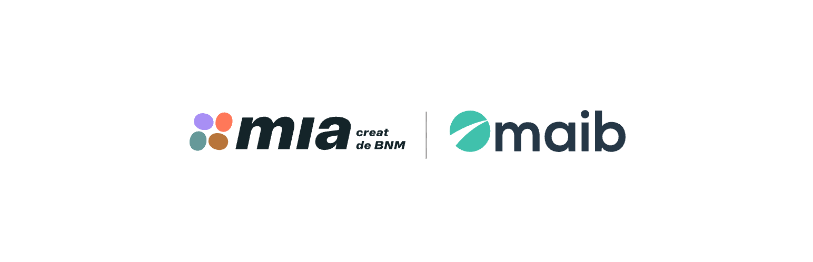
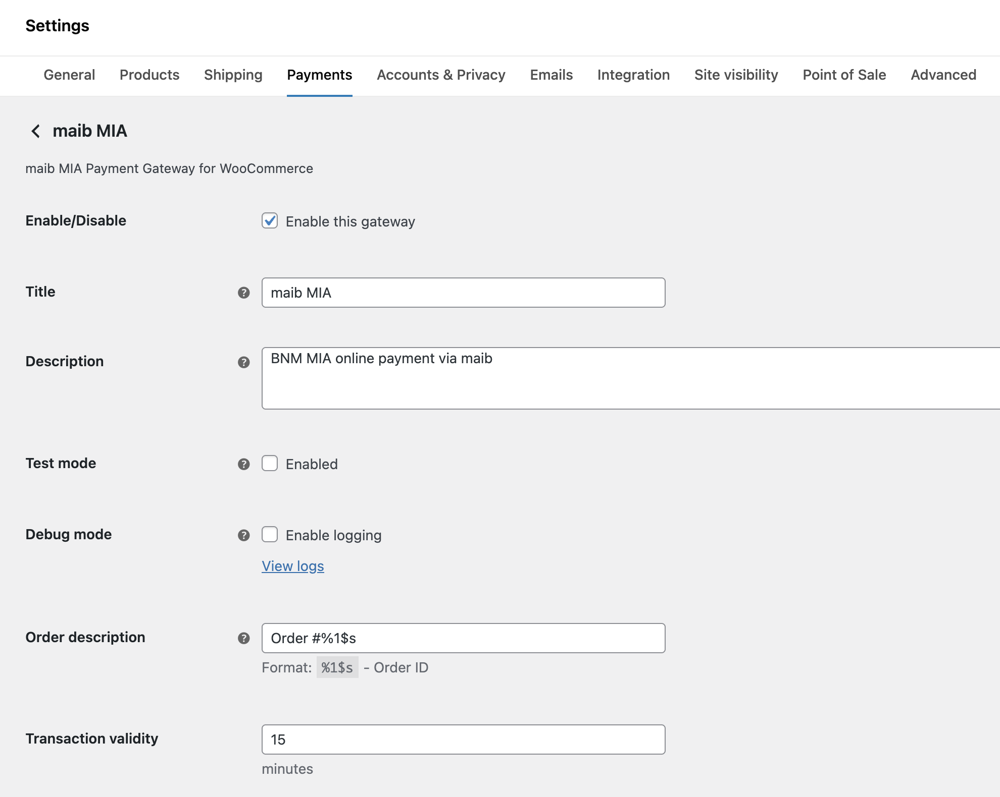
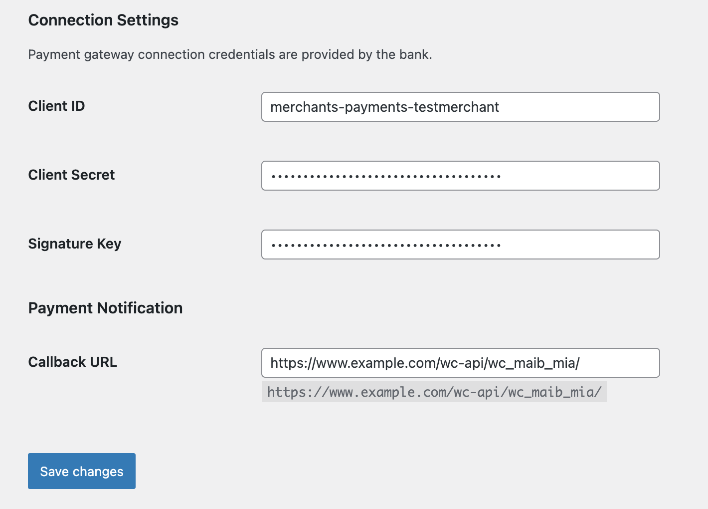
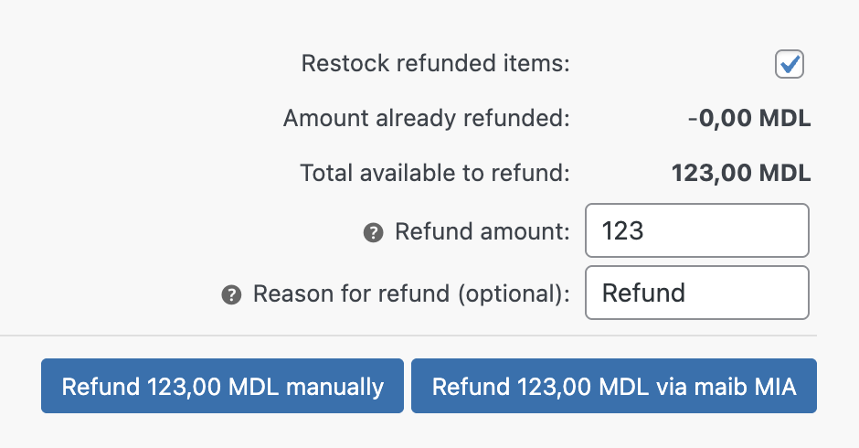

# maib MIA Payment Gateway for WooCommerce

_Accept MIA payments directly on your store with the maib MIA payment gateway for WooCommerce._

WordPress plugin: https://wordpress.org/plugins/wc-maib-mia/

## Features

* Online payments with [BNM MIA QR](https://mia.bnm.md/en)
* Reverse transactions – complete refunds[^1]
* Supports WooCommerce [block-based checkout experience](https://woocommerce.com/checkout-blocks/)
* Free to use – [Open-source GPL-3.0 license on GitHub](https://github.com/alexminza/wc-maib-mia)

[^1]: Partial refunds are not currently supported by maib MIA.

## Getting Started

* [Installation Instructions](https://wordpress.org/plugins/wc-maib-mia/installation/)
* [Frequently Asked Questions](https://wordpress.org/plugins/wc-maib-mia/faq/)

## Screenshots

1\. Plugin settings

2\. Connection settings

3\. Refunds

