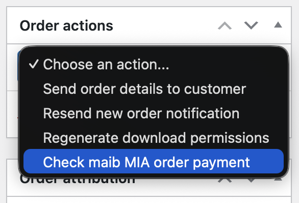

# Payment Gateway for maib MIA for WooCommerce

_Accept MIA Instant Payments directly on your store with the Payment Gateway for maib MIA for WooCommerce._

WordPress plugin: https://wordpress.org/plugins/payment-gateway-wc-maib-mia/

## Features

* Online payments with [MIA Instant Payments](https://mia.bnm.md/en)
* Reverse transactions – complete refunds[^1]
* Admin order actions – check order payment status
* Supports WooCommerce [block-based checkout experience](https://woocommerce.com/checkout-blocks/)
* Free to use – [Open-source GPL-3.0 license on GitHub](https://github.com/alexminza/payment-gateway-wc-maib-mia)

[^1]: Partial refunds are not currently supported by maib MIA.

## Getting Started

* [maib MIA](https://www.maib.md/en/plati-prin-qr-mia)
* [Installation Instructions](https://wordpress.org/plugins/payment-gateway-wc-maib-mia/installation/)
* [Frequently Asked Questions](https://wordpress.org/plugins/payment-gateway-wc-maib-mia/faq/)

## Screenshots

1\. Plugin settings

2\. Connection settings

3\. Refunds

4\. Order actions

